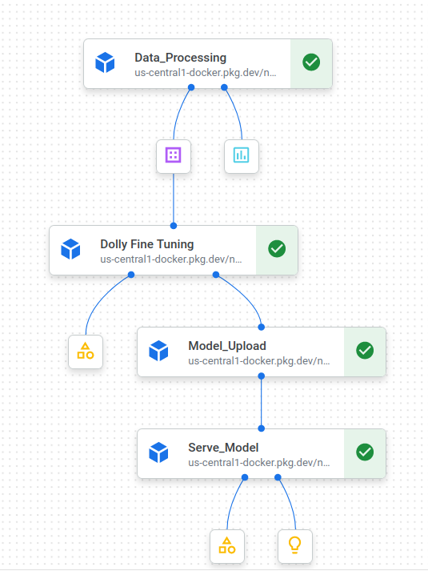

# Databricks/Dolly-v2-3b Model For Question Answering

## Overview
As a pillar, we've decided to adopt [Kubeflow](https://www.kubeflow.org/docs/started/introduction/)
as our primary solution for MLOps in our model build pipelines. Kubeflow is an OSS project designed to make deployments 
of ML workflows on Kubernetes simple, portable, and scalable.
[Kubeflow Pipelines](https://www.kubeflow.org/docs/components/pipelines/introduction/) is the orchestration solution 
within Kubeflow. It provides a scheduling engine for DAG-based workflows, a UI for managing and tracking
pipeline runs, and an SDK for defining and manipulating pipelines and their components.
Once defined, pipelines are run on a Kubernetes cluster running the Kubeflow management
services. We've adopted [Vertex AI Pipelines](https://cloud.google.com/vertex-ai/docs/pipelines/introduction)
as a managed solution for such clusters.

## Some Basic Terminology

1. Component -- reusable task definition; defined by 3 things:
   1. Docker image
   2. Code that runs in the Docker image
   3. I/O contract
2. Step -- an instance of a component in a pipeline
3. Pipeline -- a combination of steps that makes up a DAG
   1. Also includes things like resource limit requests and other Kubernetes configuration
4. Run -- an execution of a particular pipeline


## Resources
- Lightweight [components](https://www.kubeflow.org/docs/components/pipelines/v2/components/lightweight-python-components/).
- Containerized Python [components](https://www.kubeflow.org/docs/components/pipelines/v2/components/containerized-python-components/).
- Container [data types](https://www.kubeflow.org/docs/components/pipelines/v2/data-types/parameters/).
- Kubeflow [CLI](https://kubeflow-pipelines.readthedocs.io/en/master/source/cli.html#kfp-component-build).
- Machine Type [Specifications](https://cloud.google.com/vertex-ai/docs/pipelines/machine-types).
- General Purpose [Machines](https://cloud.google.com/compute/docs/general-purpose-machines).

#### Note make sure these file: [SETUP](/media/knoldus/HDD/JIRA/clustering-kubeflow-pipeline/setup.py), [VERSION](/media/knoldus/HDD/JIRA/clustering-kubeflow-pipeline/version.txt) is present in your project root folder.
##### You can change the details in setup.py accordingly

## The Modeling Task

The primary responsibility of this job involves the training and deployment of a Large Language Model (LLM) to excel 
in the task of answering questions based on textual data.

In addition to this, the position will also require the candidate to fine-tune the model, optimize its performance, 
and ensure its seamless integration into the existing infrastructure for efficient utilization in real-world applications. 
Furthermore, the role may involve collaborating with cross-functional teams to gather and preprocess relevant textual data, 
develop and maintain data pipelines, and continuously improve the model's accuracy and effectiveness in delivering 
insightful answers to a wide range of questions.

## Kubeflow DAG


## Pipeline Configuration
Below is the pipeline definition. We will add tasks which are instances of components to this pipeline. In order identify which pipeline is submitted by you please change pipeline name by appending your name.

```python
"""
PIPELINE_NAME = "Your-Pipeline_Name"
PIPELINE_DESCRIPTION = "Pipeline Description"
PIPELINE_JSON = './pipeline.json'
PIPELINE_ROOT_GCS = "gs://your-gcs-bucket"

@kfp.dsl.pipeline(name=PIPELINE_NAME,
                  description=PIPELINE_DESCRIPTION,
                  pipeline_root=PIPELINE_ROOT_GCS)
def pipeline(
        project_id: str,
        job_id: str
):
"""
```

## Execute Pipeline Run:

For this project we create a cloud build trigger over GCP,
[Create Cloud Build Trigger Reference](https://cloud.google.com/build/docs/automating-builds/create-manage-triggers)

#### Note: You can create your own cloud build trigger and define the path of your "cloudbuild.yaml" file by linking you source repository,

- In this case we use used [Github](https://github.com) for our source code repository.
- Define the location of [cloudbuild.yaml](/media/knoldus/HDD/JIRA/clustering-kubeflow-pipeline/cloudbuild.yaml) file located in your repository in cloud build trigger.
- Set Invocation to run on push.
- Approve build run when ever the new push to repo is created (If Build is Required).

#### Note: Please change the bucket names or create buckets over gcp accordingly, as well as in [cloudbuild.yaml](/media/knoldus/HDD/JIRA/clustering-kubeflow-pipeline/cloudbuild.yaml) and [serve_model_build.yaml](/media/knoldus/HDD/JIRA/clustering-kubeflow-pipeline/serving_container/serve_model_build.yaml) file, see the [constants](/media/knoldus/HDD/JIRA/clustering-kubeflow-pipeline/constants.py) file for your reference.
### See Status of Cloud Build in History over Cloud Build Page on GCP.